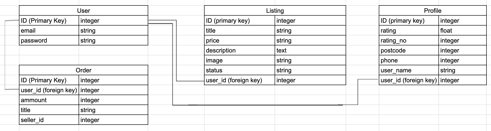
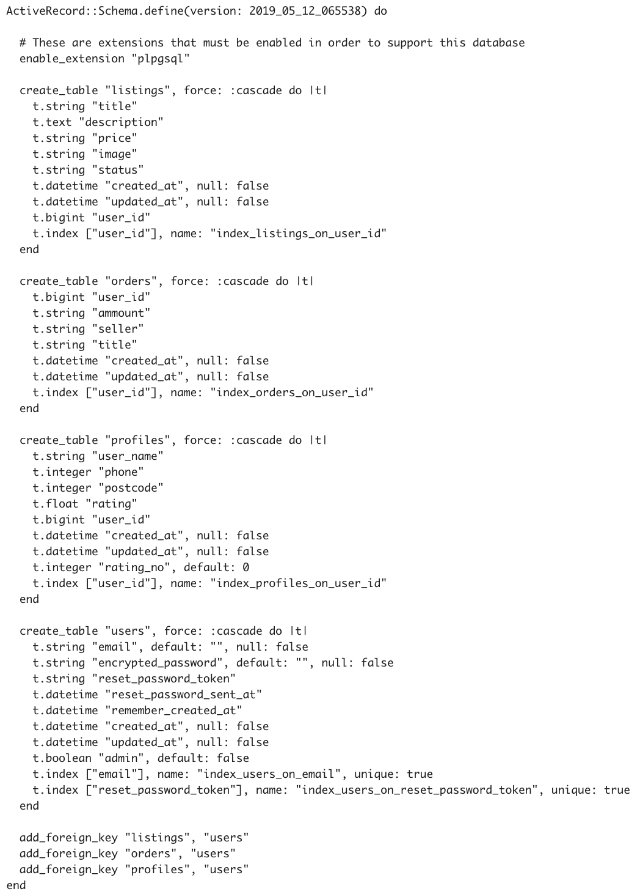
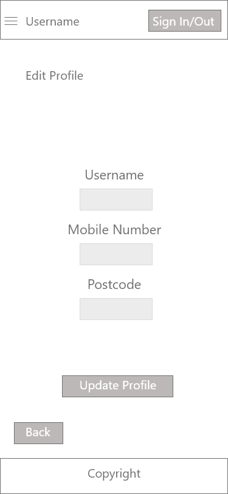
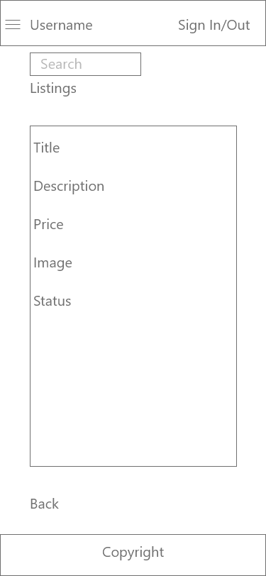
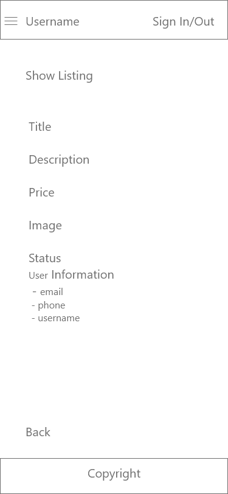
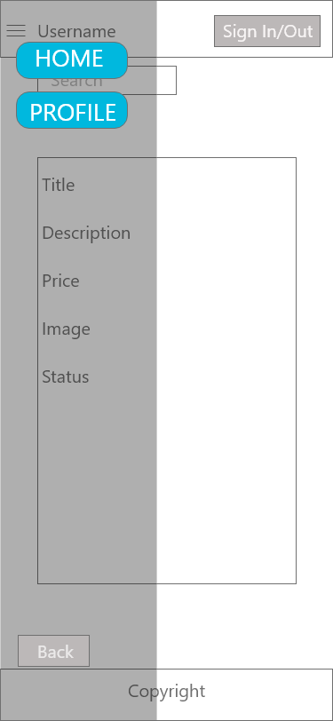
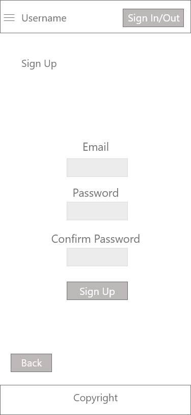
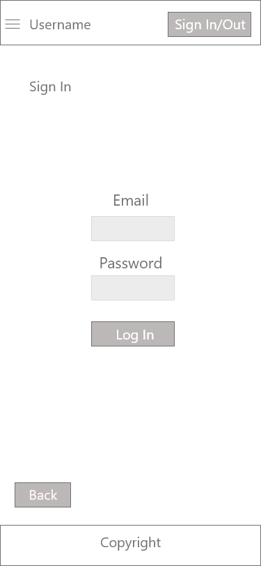

### The Problem
People require tools for all sorts of tasks from hanging up pictures to painting a house, from reaching high places to removing unwanted flora. Tools help make these tasks manageable, however, a single tool in an expensive purchase for a task one might only complete once a year. 

### The Solution 
People who require tools infrequently could be well serviced by an app that enables them to rent tools for the short period that they actually require them for. This will not only save them money in the short term but will also enable tool owners to make money off of their tools that would otherwise lay around not being used.

### The Project
Create a web app using the rails framework to address the need for a tool renting service. Provide users with a two way market place on which to sell time with tools.

### Source Control
We used a github branching strategy to manage the changes to the final version. This requires transparency and good communication about what specifically we had planned to work on. This made merging back to the master branch simple. 

### Task Allocation
Tasks were allocated through group discussion with time constraints and team member confidence levels taken into consideration. Team members opted to volunteer for tasks that they felt more comfortable with. While tasks were assigned to specific team members the time constraints and agile methodology allow for tasks to be redefined and team member allocation to be reassessed. 

### Discuss how Agile methodology is being implemented in your project.
This ties into how the tasks were allocated in the beginning. Each time a task was completed, we’d discuss what remained and what could be done with the time left that day. An informal approach and it relies on clear communication and discipline to do strictly what we had committed to do.

### Team communication 
The team communicated by slack and kept track of allocated tasks via trello. https://trello.com/b/47PIiFMN/assessment

### Data structure of similar apps
While there are a lot of variations amongst other similar apps, they tend to follow the same basic structure. They contain a table of users with relates to a table of listings in a one to many relationship. Often they contain a shopping cart that can only be assumed to be contained in a table of shopping carts with a one to one relationship with the users table.

### Database relationships and schema discussion
When it came to implementing a database that would be sufficient for the tasks required, a lot of thought was put into the tables that would be included and their relationships. Below a relational diagram details the tables and connections that exist within the database.

As can be seen in the diagram there are a number of relations present in the database. The active records relations were outlined in the models as follows. User: has one profile, has many listings, has many orders. Listing: belongs to user. Profile: belongs to user. Order: belongs to user. 

### Discuss methods you will use to protect information and data.
The only sensitive data stored in the app are the email and password required for a user to login and a users phone number and postcode required for making a listing. Devise automatically encrypts the password ensuring secure storage. User emails, phone numbers and postcodes are only available to users who are logged in and have requested to see the information of the owner of a particular listing.

### Detail any third party services and software that your App will use.
The app was created using the rails framework. It uses postgresql to manage the database. Devise to manage the authentication and authorisation. Stripe to handle the payments and security of payment information. Cloudinary allows users to upload and download images through our application interface and stores user uploaded images in their servers. The app will be deployed on heroku but as of this update this is not the case.

### Concerns with handling user data.
As the creators and therefore owners of the application it is our responsibility to protect the sensitive informations our customers trust us with. It our duty to protect against theft, misuse, interference, loss, unauthorised, access, modification and disclosure. Devise was implemented in order to secure user passwords and limit the ability to create fake accounts. There is the possibility of user emails, phone numbers and postcodes being taken from their profiles and used by other users with nefarious purpose. In order to limit the potential for this negative occurrence to happen, user contact information is only available to other users if they are viewing a listing created by that user or if they know the URL required to reach that user’s profile. Originally it was intended for user profiles to be posted to URLs determined by their usernames, however, due to time constraints this feature has not yet been implemented. This means that currently a nefarious user could potentially visit every users profile sequentially to scourer users usernames, emails, phone numbers and postcodes. This is a concern that would need to be fixed before deployment.

### Explain the different high-level components (abstractions) in your App.
We implemented Devise to handle the authorisation and authentication for the Users. Postgresql is a database management program that hosts our application’s information. Stripe is a third party API (Application Programming Interface) that integrates with Rails using a gem. Cloudinary is another third party API that handles image upload and storage for the users to use when creating new listing. Bundle is a built in gem for rails that handles the gem versions required to run the application.

### Application Architecture
Ruby on Rails uses the Model-View-Controller architecture. Rails has an overarching methodology “Convention over Configuration” which boils down to demanding that the developer conforms to the built in methods which aid the build process by generating large amounts of HTML and Ruby code, which saves the developer time. 

#### Model
The Model is what communicates directly with the applications database. Our app has four models, Listing, User, Order and Profile. These handle the database relations and requests and communicate the requesting information back to the controller that requested it.

#### View
The views are directly connected to the display of the application on the webpage. The views take the information provided to it by the controllers, and makes it viewable by the user.

#### Controller
The controller receives instructions from the user via routes and communicates with the relevant model if necessary, regardless it communicates back to the user via rendering views.

### User Stories

All users should be able to:
Register 
Sign in
View and search the index of listings

In addition a logged in user should be able to:
View details of a particular listing
View profiles of users with listings
Create a profile
Edit a profile
Place an order 
Sign out

In addition a logged in user with a profile should be able to:
Make a listing
View own profile
Edit a listing
Delete a listing

As an administrator a user should also be able to:
View a list of all user profiles
Edit user profiles
Delete users 
View a list of all orders 

### Wireframes

